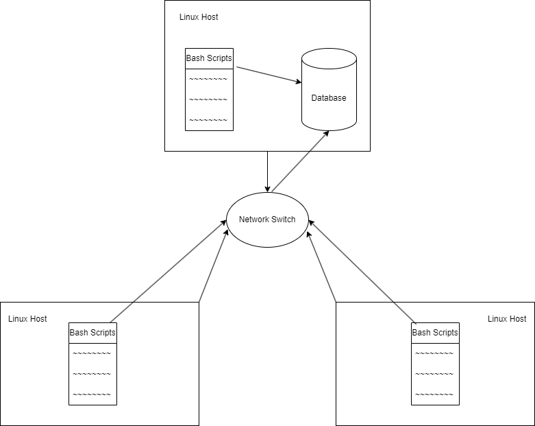

# Linux Cluster Monitoring Agent
# Introduction

The Jarvis Linux Cluster Administration (LCA) team has requested a project that helps to automate documentation for a CentOS 7 Linux cluster with 10 interconnected nodes. 
The primary goal is to record hardware specifications and monitor real-time resource usage. The project relies on a PostgreSQL (psql) instance for persistent data storage.

Two essential bash scripts facilitate the process:

host_info.sh: Captures and inserts hardware information during the initial installation.

host_usage.sh: Executes scheduled updates, capturing and inserting current resource usage (CPU and memory) data at regular intervals using cron.

Using bash scripting, PostgreSQL, Docker, and cron facilitates Linux cluster administration, providing administrators with valuable insights into the health and resource planning of their cluster.

# Quick Start

### Start a psql instance using psql_docker.sh
```
./scripts/psql_docker.sh start|stop|create [db_username][db_password]
```
### Create tables using ddl.sql
```
psql -h [hostname] -U [username] -d [db_name] -f sql/ddl.sql
```
### Insert hardware specs data into the DB using host_info.sh
```
./scripts/host_info.sh [psql_host] [psql_port] [db_name] [psql_user] [psql_password]
```
### Insert hardware usage data into the DB using host_usage.sh
```
./scripts/host_usage.sh [psql_host] [psql_port] [db_name] [psql_user] [psql_password]
```
### Crontab setup
```
* * * * * bash /home/centos/dev/jrvs/bootcamp/linux_sql/host_agent/scripts/host_usage.sh localhost 5432 host_agent postgres password > /tmp/host_usage.log
```

# Implemenation

The task at hand is to create a Minimum Viable Product (MVP) to address the business needs of the LCA team. 

Responsibilities include presenting the functional MVP at the project's deadline. 

The implementation involves using technologies like Bash scripts, PostgreSQL, Docker, and Crontab such that users
will be able to use SQL queries to view important hardware/usage data for each node in the Linux cluster.

In detail: 
-a Docker container is created and  an PSQL instance is provisioned.
-A Structured database is created to store Hardware Info and Resource Usage.
-`host_info.sh` and `host_usage.sh` are used to populate the tables, along with crontab to automate information collection.
-Using SQL users can manually view the contents of the table.

## Architecture


## Scripts
Shell script description and usage


### psql_docker.sh
This script is used to create a psql instance if one doesn't exist and also has functions to start/stop the instance.
```
./scripts/psql_docker.sh [start|stop|create] [db_username] [db_password]
```

`[start|stop|create]`: Starts/Stops/Creates the PostgreSQL Docker container.

`[db_username]`:  PostgreSQL database username

`[db_password]`: PostgreSQL database password
  
### host_info.sh
This script records the hardware specifications of the node and logs it into the database table host_info. It is meant to be run once during the initialization of each node.
```
./scripts/host_info.sh [psql_host] [psql_port] [db_name] [psql_user] [psql_password]
```
`[psql_host]`:  PostgreSQL host server address

`[psql_port]`: PostgreSQL port number

`[db_name]`: Name of the PostgreSQL database

`[psql_user]`: PostgreSQL username

`[psql_password]`: PostgreSQL password
  
### host_usage.sh
this script is set to record the resource usage of the node,  logging the information into the host_usage table.
```
./scripts/host_usage.sh [psql_host] [psql_port] [db_name] [psql_user] [psql_password]
```
`[psql_host]`:  PostgreSQL host server address

`[psql_port]`: PostgreSQL port number

`[db_name]`: Name of the PostgreSQL database

`[psql_user]`: PostgreSQL username

`[psql_password]`: PostgreSQL password
  
### crontab
This crontab script will run host_usage.sh script every minute. To use, type `crontab -e` into the console and input the following script:
```
* * * * * bash /home/centos/dev/jrvs/bootcamp/linux_sql/host_agent/scripts/host_usage.sh localhost 5432 host_agent postgres password > /tmp/host_usage.log
```

  
### queries.sql
This script will select everything from the table host_info, displaying the id, hostname, computer number, architecture, model, mhz, l2 cache, and total memory and their values.
```
SELECT * FROM host_info
```
This script will select everything from the table host_usage, displaying the host ID, free memory, computer idle time, kernel, disk io, and disk available and their values. 
```
SELECT * FROM host_usage
```


## Database Modeling
Describe the schema of each table using markdown table syntax (do not put any sql code)
### `host_info`: Hardware Info

| Column | Type | Constraint |
| --- | --- | --- |
|id | SERIAL | NOT NULL|
|hostname | VARCHAR | NOT NULL|
|cpu_number | INT2 | NOT NULL|
|cpu_architecture | VARCHAR | NOT NULL|
|cpu_model | VARCHAR | NOT NULL|
|cpu_mhz | FLOAT8 | NOT NULL|
|l2_cache | INT4 | NOT NULL|
|timestamp | TIMESTAMP | NOT NULL|
|total_mem | INT4 | NULL|

### `host_usage` Resource Usage

| Column | Type | Constraint |
| --- | --- | --- |
|timestamp | TIMESTAMP | NOT NULL|
|host_id | SERIAL | NOT NULL|
|memory_free | INT4 | NOT NULL|
|cpu_idle | INT2 | NOT NULL|
|cpu_kernel | INT2 | NOT NULL|
|disk_io | INT4 | NOT NULL|
|disk_available | INT4 | NOT NULL|

# Testing
To test the DDL script, the following command was used: `psql -h localhost -U postgres -d host_agent -f sql/ddl.sql`

Initially, the table was already created manually so the script outputted:
```
You are now connected to database "host_agent" as user "postgres".
psql:sql/ddl.sql:18: NOTICE:  relation "host_info" already exists, skipping
CREATE TABLE
psql:sql/ddl.sql:32: NOTICE:  relation "host_usage" already exists, skipping
CREATE TABLE
```

Deleting the tables and running the script again outputs:
```
CREATE TABLE
```
upon checking the database, the tables are successfully created and ready to populate.

To test the `host_info.sh` and `host_usage.sh`, the scripts were inputted manually and checked manually.

To test the crontab, the script was run once on its own to make sure it would run, then observed over 5 minutes to see if it would run at specified interval.

# Deployment
To automate the app, crontab was used to run the script every minute

To deploy the app, GitHub was used to store all the scripts and files needed to run the scripts that facilitate the information collection.

# Improvements

- Handle modifying existing data inside host_info table in case hardware is changed.
- Create a master script that will run all scripts so that I don't have to run each script individually
- Create a script that will delete the usage data after a certain point to prevent the database from using an excess amount of storage.

